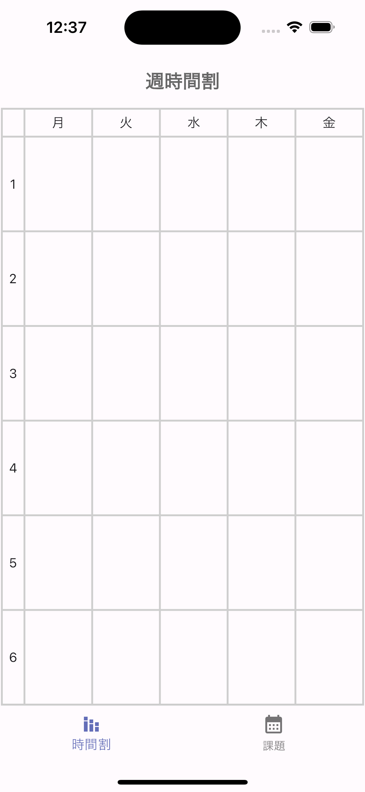
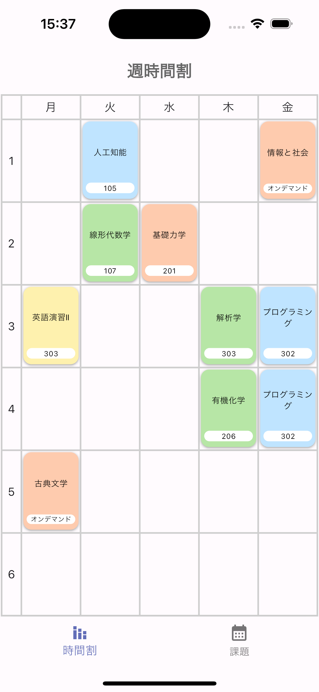
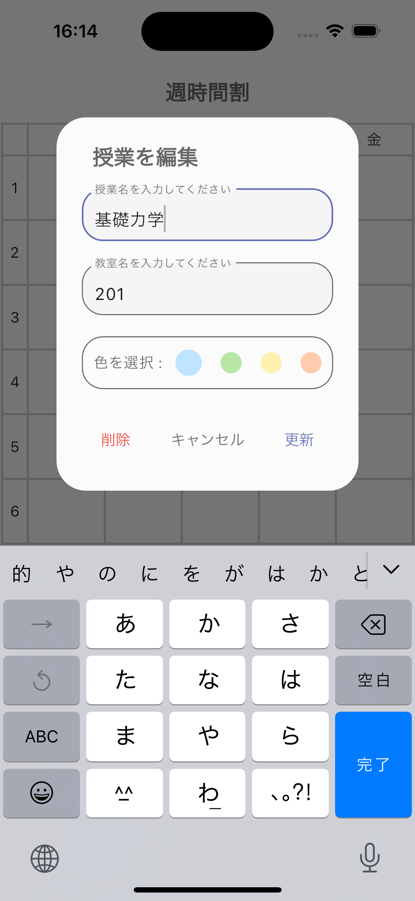
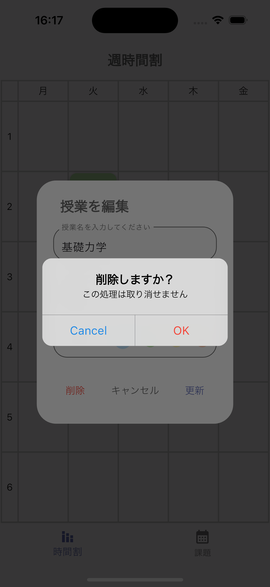
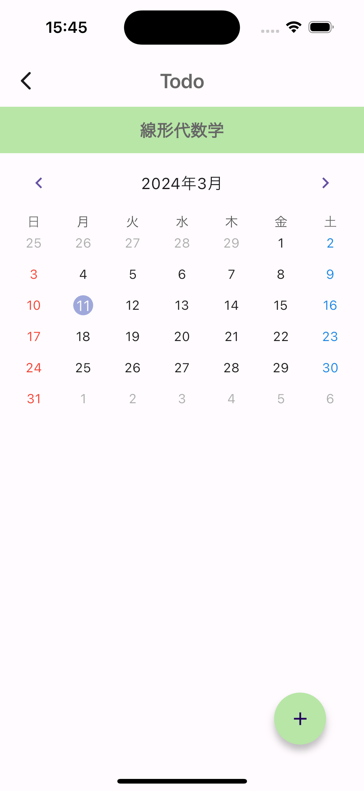
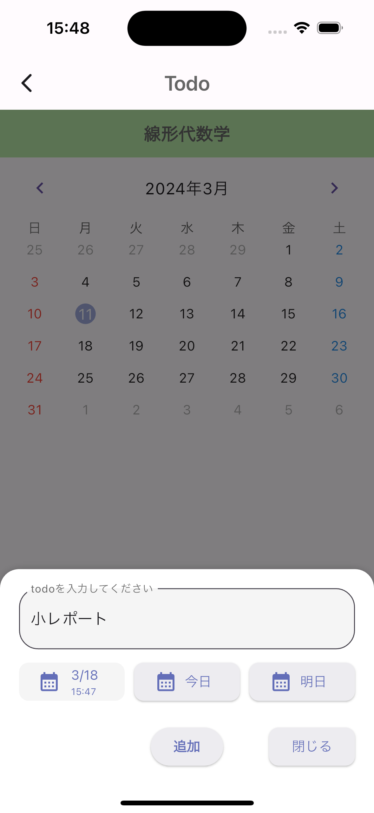
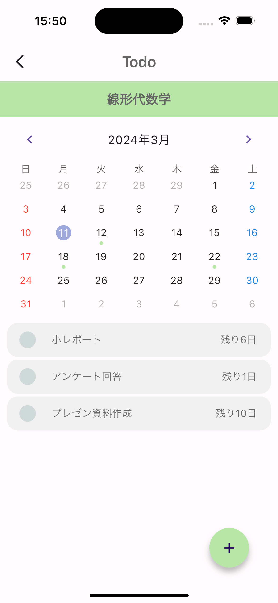
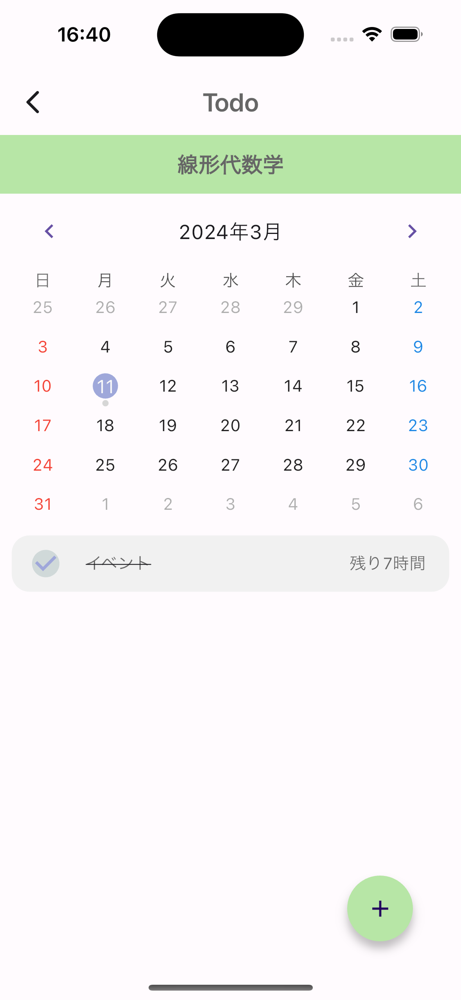

# Todo & Time Table App

学校で出される課題（Todo）を時間割とまとめて管理することができるアプリケーションを作成しました。

### 時間割のページの使い方
#### 時間割の追加方法
↓ メインページ

週時間割のページで追加したいマスをタップすると、授業を追加することができます。授業を追加する際は授業名、教室名と色を選択します。

 

↓ 授業を追加した後の画面

#### 時間割の編集・削除方法
時間割のページで授業のアイコンを長押しすると、その授業の情報を編集・削除をすることができます。

---

### Todoのページの使い方
#### Todoの追加方法
時間割に追加した授業のアイコンをタップすると、その授業専用のページに移動します。そのページでは画面右下のボタンを押すことで、その授業の課題（Todo）を追加することができます。

↓ 授業の専用ページとTodoを追加した後の画面

Todoの追加には、Todoの内容、期限を設定することします。期限の設定には、次のような方法があります。
1. "今日"を選択する (時刻は当日の23時59分59秒に設定されます)
2. "明日"を選択する (時刻は当日の23時59分59秒に設定されます)
3. "期限"を選択し、カレンダーから日付や時刻を選択する

↓ "期限"を選択したときの画面①

 

↓ "期限"を選択したときの画面②

#### Todoの編集・削除方法
TodoのページでTodoのアイコンを長押しすると、そのTodoの情報を編集することができます。また、画面に追加されたTodoを右にスワイプすることでもTodoを編集することができます。
また、画面に追加されたTodoを左にスワイすると、そのTodoを削除することができます。

↓ Todoの編集・削除画面

#### Todoの完了・未完了の切り替え
TodoのページでTodoのアイコンをタップすると、そのTodoの完了・未完了を切り替えることができます。完了したTodoはチェックマークが表示され、Todoの内容に取り消し線が引かれます。

また、画面上部のカレンダーには、その日が締め切りのTodoがイベントマークとして表示されます。このイベントマークは、未完了のTodoは色付きで表示され、完了したTodoはグレーで表示されます。Todoを完全に削除すると、そのTodoのイベントマークも削除されます。

↓ Todoが完了したときの画面

---

### 全体の課題管理ページの使い方
各授業で追加したTodoを一覧で閲覧することができるページです。
※ この機能は開発中です。

---

### 使用した技術
|カテゴリ |技術 |
|:---:|:---:|
| フロントエンド | Flutter |
| バックエンド | Shared preferences (flutter package) |
| デザイン | Figma |

### 最後に
プロジェクトをご覧いただき、ありがとうございます。このアプリケーションは、現役大学生の私が初めてのアプリ開発として作成したものです。まだまだ機能が不十分な部分も多いですが、今後も改善を続けて行いければと思います。
